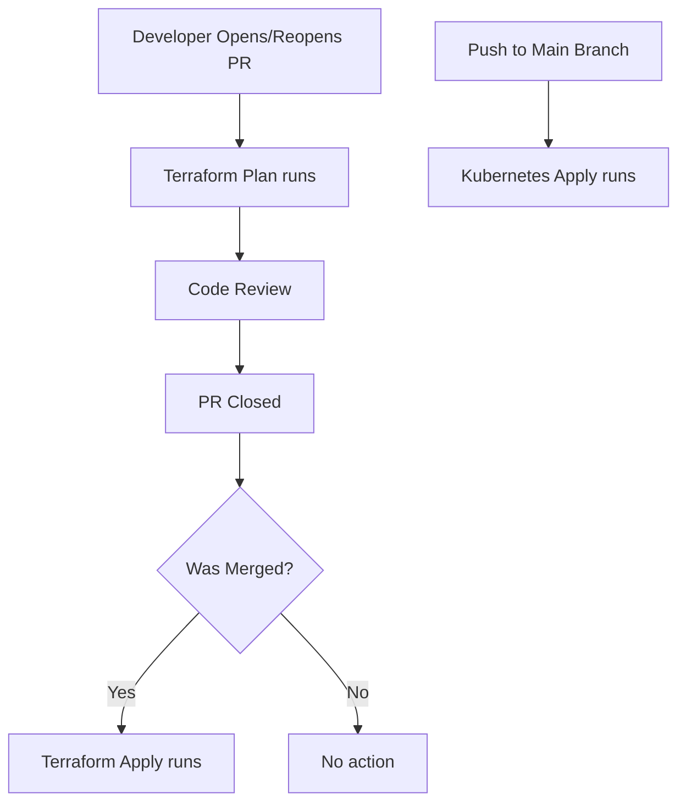

## 1. CI/CD Pipeline (Terraform and Kubernetes)

I have implemented GitHub Actions for automating both **Terraform** infrastructure deployments and **Kubernetes** application deployments.

### Terraform CI/CD

| Stage | Trigger | Action |
|:------|:--------|:-------|
| **Plan** | On PR Open / Reopen to `main` | Runs `terraform plan` |
| **Apply** | On PR Close (Merged Only) to `main` | Runs `terraform apply` |

- **Plan Workflow**: `bonus/tf-plan.yaml`
- **Apply Workflow**: `bonus/tf-apply.yaml`

### Kubernetes CI/CD

| Stage | Trigger | Action |
|:------|:--------|:-------|
| **Deploy** | On Push to `main` | Applies Kubernetes manifests |

- **Deploy Workflow**: `bonus/k8s.yaml`

### CI/CD Workflow

---

## 2. Disaster Recovery and Scaling Strategy

**Disaster Recovery:**

- **S3 Data Backups**: All important data stored in AWS S3 with lifecycle policies.
- **Multi-AZ Deployments**: RDS, backend services deployed across multiple Availability Zones.
- **Infrastructure as Code**: Terraform definitions allow rapid redeployment.
- **Periodic Backups**: Using AWS Backup for EFS, RDS, and DynamoDB.

**Scaling Strategy:**

- **Horizontal Pod Autoscaler (HPA)**: Auto-scales pods based on CPU utilization.
- **Load Testing**: Using `k6` or `Locust` or `JMeter` to simulate traffic and verify auto-scaling.
- **Cluster Auto-scaler**: Scale node groups automatically based on pod demand.

**Example:**  
Simulating 10x traffic will trigger Kubernetes HPA to spin up more pods automatically.

---
# Usage

### Terraform

1. Open a PR to `main` → Terraform Plan runs.
2. Merge the PR → Terraform Apply runs automatically.

### Kubernetes

- Push to `main` branch → Kubernetes manifests are automatically applied.
