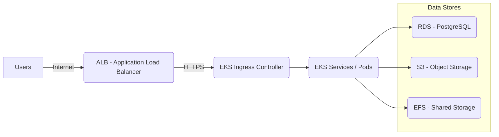

# 1. Architecture Components
## Networking Layer (VPC and Subnets)
-   **VPC**: Custom VPC.
    
-   **Subnets**:
    
    -   3 Private Subnets across 3 Availability Zones (AZs) for EKS worker nodes and databases.
        
    -   3 Public Subnets across the same AZs for ALB (Load Balancer) and NAT Gateways.
        
-   **Internet Gateway**: Attached to VPC for outbound internet access from public subnets.
    
-   **NAT Gateway**: One in each AZ for Private Subnet outbound internet access.

## Compute Layer (EKS Cluster)
-   **Amazon EKS** (Elastic Kubernetes Service):
    
    -   Manages containerized AI application deployments.
        
    -   Auto-scaling Node Groups (managed by AWS Managed Node Groups).
        
    -   Worker nodes run in **Private Subnets** for security.
        
-   **EKS Add-ons** (optional but recommended):
    
    -   CoreDNS, kube-proxy, VPC CNI.
        
    -   Cluster Autoscaler for automatic scale-out/in of nodes.
## Auto-scaling

-   **Cluster AutoScaler** for EKS:
    
    -   Scales worker nodes based on pod demands.
        
-   **Horizontal Pod AutoScaler (HPA)**:
    
    -   Scales pods based on CPU/memory metrics automatically.
## Load Balancing Layer

-   **AWS Application Load Balancer (ALB)**:
    
    -   Placed in **Public Subnets**.
        
    -   Distributes traffic to EKS service pods.
        
    -   Supports SSL termination (HTTPS) with AWS Certificate Manager (ACM).
## Data Storage Layer

-   **Amazon RDS (PostgreSQL)**:
    
    -   Highly available (Multi-AZ deployment).
        
    -   Encrypted at rest with AWS KMS.
        
-   **Amazon S3**:
    
    -   For object storage (user uploads, reports, model output files).
        
    -   Encrypted buckets (SSE-S3 or SSE-KMS).
        
-   **Amazon EFS**:
    
    -   For shared persistent storage between pods if needed (like shared cache or temp storage).
## IAM, Security, Monitoring

-   **IAM Roles and Policies**:
    
    -   Fine-grained IAM roles for EKS service accounts (IAM Roles for Service Accounts - IRSA).
        
    -   Least privilege principle for all access.
        
-   **Security Groups**:
    
    -   Restrictive, least-access firewall rules for ALB, EKS nodes, RDS.
        
-   **AWS WAF** (Web Application Firewall):
    
    -   Protects ALB from common web attacks.
        
-   **AWS CloudWatch**:
    
    -   Logs: Application logs, infrastructure logs from EKS nodes.
        
    -   Metrics: CPU, memory usage of pods, node health, etc.

# 2. High Availability, Scalability, Security Considerations
## High Availability

-   EKS and ALB span **three Availability Zones**.
    
-   Multi-AZ RDS for failover.
    
-   Cluster Autoscaler for EKS ensures enough capacity during demand spikes.
    

## Scalability

-   Horizontal Pod AutoScaler (HPA) to scale pods dynamically.
    
-   Cluster Autoscaler to automatically add/remove nodes.
    
-   ALB supports auto-scaling to handle any number of incoming requests.
    

## Security

-   All traffic is HTTPS (SSL certificates from ACM).
    
-   Only necessary ports open via Security Groups.
    
-   Private subnets for EKS nodes and RDS (no public IPs).
    
-   IAM policies follow least privilege access.

