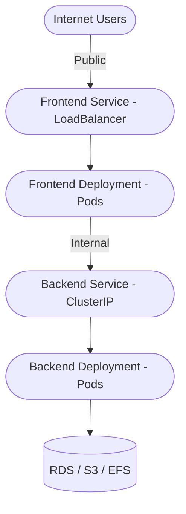

# Deployment Instructions

1.  Connect your `kubectl` to EKS:

    `aws eks --region <your-region> update-kubeconfig --name <your-cluster-name>` 
    
2.  Apply the backend first:

    `kubectl apply -f task3/backend/manifests` 
    
3.  Then apply the frontend:

    `kubectl apply -f task3/frontend/manifests` 
    
4.  Verify changes:
    
    `kubectl get deployments`\
    `kubectl get services`\
    `kubectl get hpa` 
    

Frontend will be available through a **public LoadBalancer** which you can check:

`kubectl get svc frontend`

