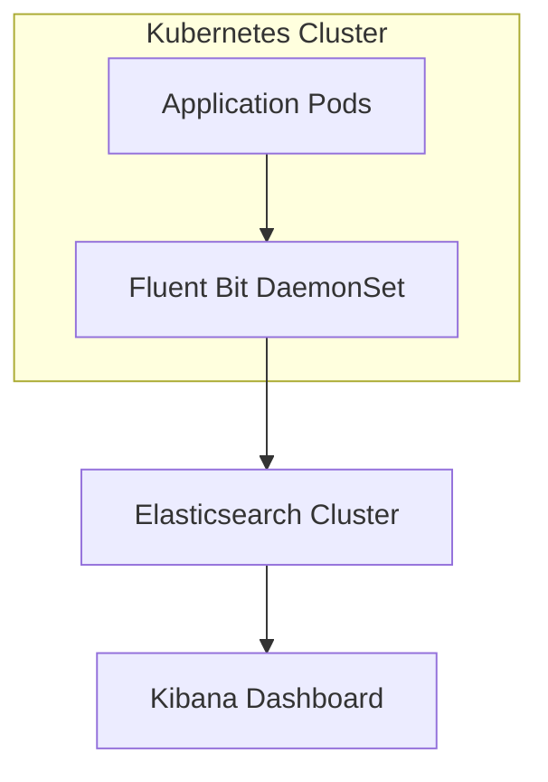

# Centralized Logging Setup on EKS (ELK Stack)

This setup enables centralized logging for your Kubernetes applications using the **Elastic Stack (ELK)**:
- **Elasticsearch** for storing logs.
- **Logstash** for processing and parsing logs (optional).
- **Kibana** for visualizing logs.
- **Fluent Bit** for lightweight log shipping from Kubernetes nodes.

---

##  Stack Components

| Component    | Purpose                          |
|--------------|----------------------------------|
| Elasticsearch | Store and index logs              |
| Fluent Bit    | Collect logs from Kubernetes nodes |
| Kibana        | Visualize logs through dashboards |

---

## Prerequisites

- EKS cluster.
- `helm 3` installed.
- `kubectl` configured.
- A namespace `logging` (or any custom namespace).

---

## Deployment Steps

1. **Add Bitnami and Elastic Helm Repos**

`helm repo add bitnami https://charts.bitnami.com/bitnami`\
`helm repo add elastic https://helm.elastic.co`\
`helm repo update`

2.  **Create a Namespace for Logging**

`kubectl create namespace logging` 

4.  **Deploy Elasticsearch**
  
`helm install elasticsearch elastic/elasticsearch --namespace logging --set replicas=3` 

This deploys a 3-node Elasticsearch cluster for high availability.

4.  **Deploy Kibana**

`helm install kibana elastic/kibana --namespace logging --set elasticsearchURL=http://elasticsearch-master:9200` 

Kibana will connect to Elasticsearch service inside the cluster.

5.  **Deploy Fluent Bit**
 
`helm install fluent-bit bitnami/fluent-bit --namespace logging --set backend.type=es --set backend.es.host=elasticsearch-master --set backend.es.port=9200` 

Fluent Bit ships logs from all nodes and containers into Elasticsearch.

----------

##  Accessing Kibana

Forward the Kibana service to your local machine:

`kubectl port-forward svc/kibana-kibana 5601:5601 -n logging` 

Access Kibana UI at: http://localhost:5601

From Kibana:

-   Create an **Index Pattern** like `fluent-bit-*`.
    
-   Explore logs from all namespaces.

