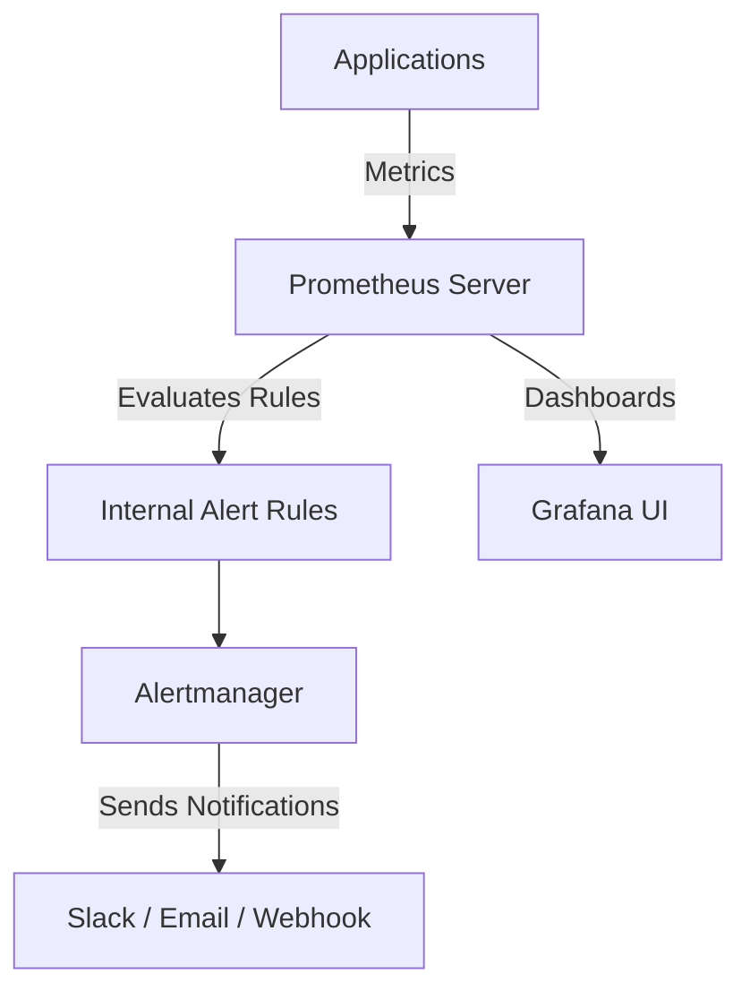

# Monitoring & Alerting Setup on EKS

This project sets up a full **monitoring and alerting stack** on your Kubernetes cluster using the **kube-prometheus-stack** Helm chart from the Prometheus Community

---

## Stack Components

- **Prometheus**: Collects and stores Kubernetes metrics.
- **Grafana**: Visualisation and dashboarding.
- **Alertmanager**: Manages alerts triggered by Prometheus.
- **Node Exporter**: Collects node metrics.
- **Kube State Metrics**: Collects Kubernetes API object metrics.

---

## Prerequisites

- EKS cluster
- `helm 3` installed.
- `kubectl` configured to your cluster.
- A namespace `monitoring` (can be created if not present).

---

## Deployment Steps

1. **Add the Prometheus Community Helm repo**

`helm repo add prometheus-community https://prometheus-community.github.io/helm-charts`\
`helm repo update`

2. **Create the monitoring namespace**

`kubectl create namespace monitoring` 

3.  **Prepare your `values.yaml`**
    
This file contains:

-   Alertmanager config
    
-   Prometheus alert rules (using `additionalRules`)
    
-   Grafana dashboard settings (optional)

4.  **Install the kube-prometheus-stack**

`helm upgrade --install monitoring prometheus-community/kube-prometheus-stack --namespace monitoring -f kube-prom-values.yaml`

## Accessing Dashboards

1.   **Grafana UI**:
    
`kubectl port-forward svc/monitoring-grafana 3000:80 -n monitoring` 

Access Grafana at: http://localhost:3000

2.  **Default Grafana credentials**:
    
    -   Username: `admin`
        
    -   Password: Retrieve using:

        `kubectl get secret monitoring-grafana -n monitoring -o jsonpath="{.data.admin-password}" | base64 --decode` 
        
----------

##  Metrics and Monitoring

-   Cluster health
    
-   Pod and container CPU/Memory usage
    
-   Node availability
    
-   Application liveness and performance metrics
    

----------

##  Alerting

-   Example alert:
    
    -   **High CPU usage** on any pod for more than 2 minutes triggers an alert.
        
-   Alerts sent to configured email/Slack.

