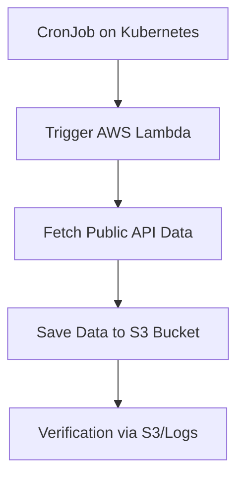

# Kubernetes CronJob Triggering AWS Lambda

This project sets up:
- A **Lambda function** that fetches data from a public API and stores it in AWS S3.
- A **Kubernetes CronJob** that **invokes** the Lambda function periodically.

---

## Setup Instructions

### 1. Create the AWS Lambda

Use the provided `lambda_function.py` and deploy it on AWS Lambda.

Set the correct IAM Role permissions:
- `AWSLambdaBasicExecutionRole`
- Access to S3 (PutObject permissions)

Example Lambda Deployment:

`aws lambda create-function --function-name fetch-api-data --runtime python3.11 --role arn:aws:iam::<account-id>:role/<lambda-role> --handler lambda_function.lambda_handler --zip-file fileb://function.zip  --region us-east-1`

### 2. Create Kubernetes Secret
Store your AWS credentials in a Kubernetes Secret.
`kubectl apply -f aws-credentials-secret.yaml`

### 3. Deploy Kubernetes CronJob
Use the cronjob-invoke-lambda.yaml file to create the CronJob.
`kubectl apply -f cron.yaml`
This job invokes Lambda every hour (0 * * * *).

You can check logs via:
`kubectl logs job/<job-name>`

